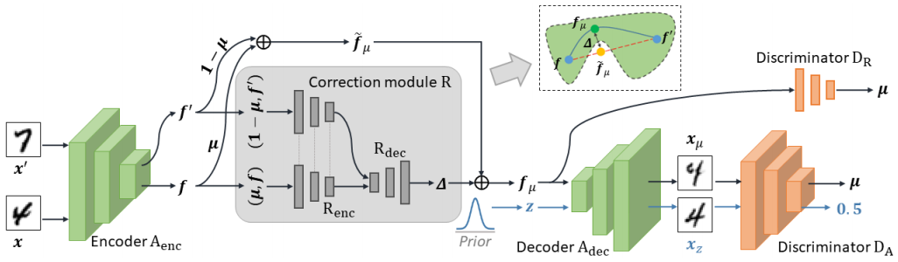
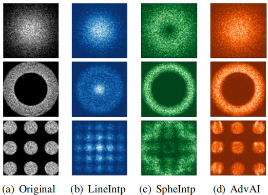
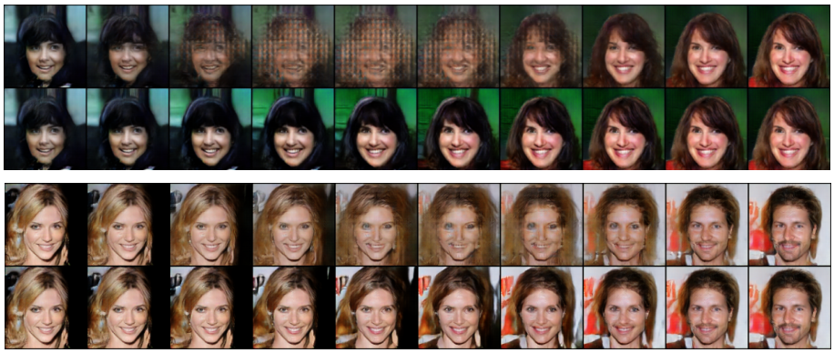

# AdvAI
Code for paper *Adversarial Adaptive Interpolation for Regularizing Representation
Learning And Image Synthesis in Autoencoders* . Accepted in International Conference on Multimedia and Expo (ICME) 2021.  

 An overview of AdvAI-AE that consists of an autoencoder, 
a correction module and two discriminators. Adversarial adaptive interpolation is 
implemented by incorporating the correction module to learn an additive correction,
which reduces the mismatch between interpolation distribution and original one. 

Distributions of the original 
interpolated points by using different interpolation techniques

 Visualization of the interpolation paths determined by
LineIntp (top row) and AdvAI (bottom row) in each example. 

## Requirements
Before running MIDR-AE, you need python==3.5.6 and the following python packages:

+ cudnn==7.1.2
+ numpy==1.15.2
+ scipy==1.1.0
+ tensorflow==1.8.0

For your ease, my conda environment is exported as file. You can easily restore the environment by typing command:

`conda env create -f environment.yaml`

My personal environment may contains some unnecessary libraries, sorry for the redundancy. It would take you about 30 minutes to download all necessary python packages.

## Running the code

There are multiple base models:

+ ACAI

+ AAE

+ base AE

Our proposed models are follows: 

+ `train_AdvAI.py`: AdvAI module.

+ `gidrae2.py`: AdvAI-AE model. (code would be updated for better readability latter)

Runing bash are follows: 

+ `train_AdvAI.sh`: AdvAI bash. 

+ `gidrae2.sh`: AdvAI-AE bash. (bash file would be added latter)

